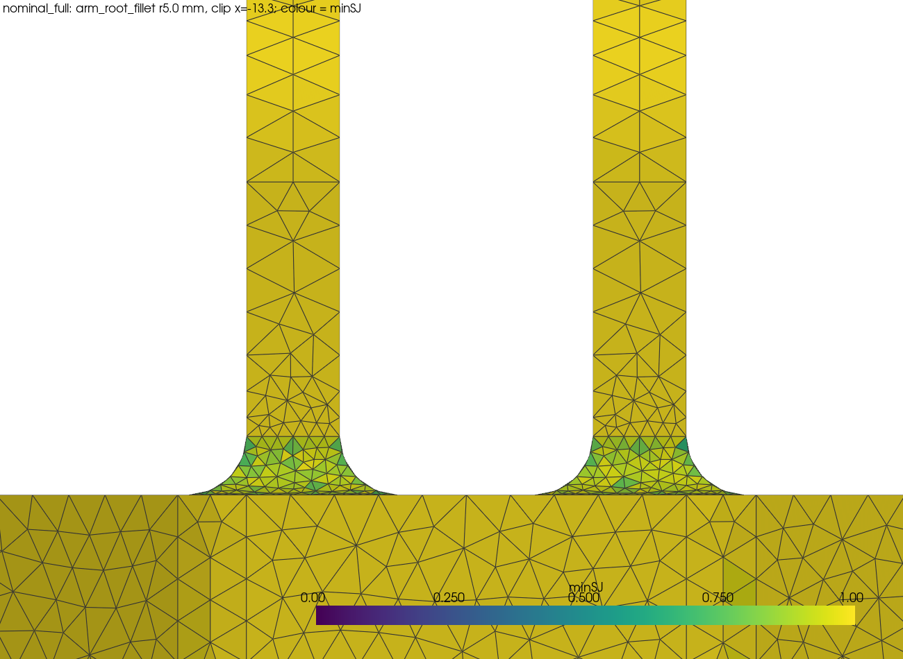
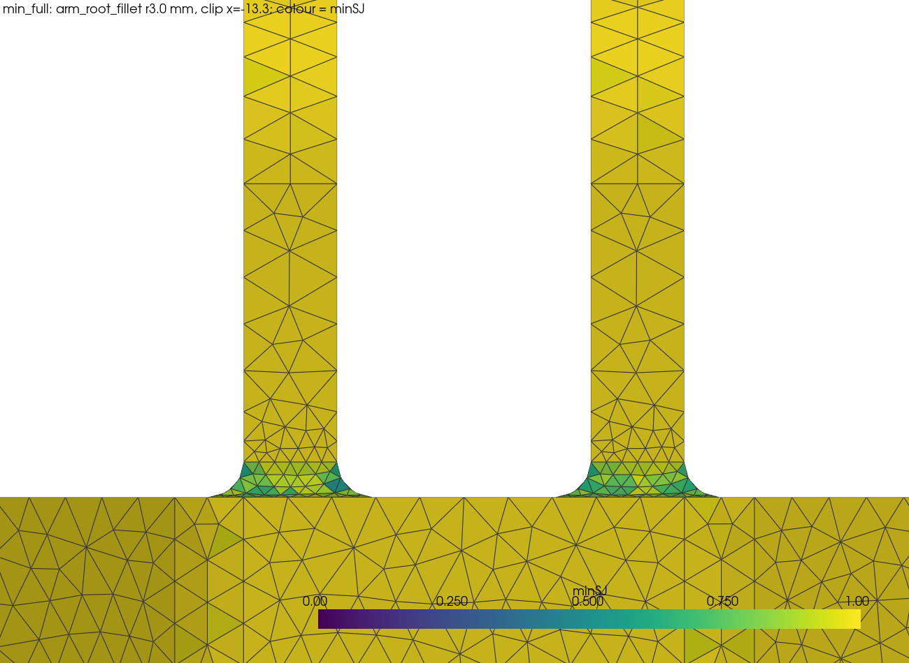

# ge_bracket mesh — D-24 sizing at nominal and minimum arm_root_fillet (M2.3)

> **22 Sep:** D-24 `MeshRegion` is now **2.0** (owner decision); this record stays as measured at 1.5. See the [M2 walkthrough §5](m2-walkthrough.md#d-24-the-mesh-sizing--applied-at-20).

| | |
| --- | --- |
| Task | M2.3 ([#45](https://github.com/sujitojha1/3d-part-optimization-agent/issues/45)) · [plan](plan.md) step 3 |
| Date | 2026-09-21 |
| Part | The parametric `ge_bracket` ([frozen record](ge-bracket-part.md)), built from `parts/ge_bracket.py` at every baseline parameter except `arm_root_fillet` |
| Tools | FreeCAD 1.1.3 FEM Workbench → `FemMeshGmsh` → Gmsh 4.15.2 (`vendor/fem-env/bin/gmsh`); quality from the Gmsh 4.15.2 Python API |
| Script | `vendor/fem-env/bin/python scripts/ge_bracket_mesh.py` (about 35 s for the seven cases). It builds the same objects as the manual steps in section 1 and writes `out/ge_bracket_mesh/mesh.json` |
| Status | **Meshing: done.** All four D-24 cases pass every threshold in section 4 at both radii. **No case inverts**, so D-24's retry never fires on its own; section 6 records what the retry produces when forced, and why its quality numbers must not be read as an improvement |

This is scratch code for the hand walk, not pipeline code. M3.2 ([#12](https://github.com/sujitojha1/3d-part-optimization-agent/issues/12)) writes the real thing.

## 1. Manual steps (FreeCAD 1.1.3 GUI)

1. **Set Gmsh to one thread.** Edit → Preferences → FEM → Gmsh, threads **1**. The script sets this
   preference for its own run and restores it. With all cores the same input does not reproduce its
   node count (measured in [M2A.2](ge-manual-mesh.md) section 1).
2. **Open the part.** Open `parts/ge_bracket.FCStd` with the repository root on `sys.path`, switch to
   the **FEM** workbench. To mesh at the minimum radius, set `Params.arm_root_fillet` to **3.0** in the
   spreadsheet and recompute; the feature rebuilds the solid and the fillet edges are re-found by
   position, so no face reference has to be repaired.
3. **Create the Analysis.** Model → **Analysis container**.
4. **Create the mesh object.** Select the bracket, then Mesh → **FEM mesh from shape by Gmsh**. In the
   task panel set **Element dimension 3D**, **Element order 2nd**, **Max size 4.0**, **Min size 1.0**.
   Close with **OK** without meshing.
5. **Set the remaining mesh properties** on `Mesh` in the Property editor:
   - `High Order Optimize` = **Optimization** (D-24; not the FreeCAD default — section 6)
   - `Second Order Linear` = **false**, so midside nodes lie on the curved geometry
   - `Optimize Netgen` = **true** (not the FreeCAD default and **not named in D-24** — section 6)
   - `Mesh Size From Curvature` = **8**
   - everything else at the default: Algorithm2D/3D Automatic, OptimizeStd true, GeometryTolerance
     1e-6, CoherenceMesh true, no recombination or subdivision.
6. **Add the one MeshRegion.** With `Mesh` selected, Mesh → **FEM mesh refinement** once. Set
   **Max element size 1.5** and add the ten faces D-24 names: the eight `arm_root_fillet` faces and
   the two `pin_bore` faces. The script picks them by `ge_bracket`'s geometric predicates
   (`gb.REGIONS["arm_root_fillet"]` and `gb.REGIONS["pin_bore"]`), never by stored index, and records
   the resolved `FaceN` list per case in `mesh.json`.
7. **Mesh.** Double-click `Mesh` → **Apply**, and record the node and element counts.
8. **Inspect the fillet** (section 5), then run the script for the quality metrics. The FreeCAD GUI
   reports neither signed nor scaled Jacobian.

## 2. D-24 sizing, frozen here

All sizes in mm; curvature is Gmsh elements per 2π of radius.

| `CharacteristicLengthMax` | `CharacteristicLengthMin` | `MeshRegion` size | `MeshSizeFromCurvature` |
| --- | --- | --- | --- |
| 4.0 | 1.0 | 1.5 | 8 |

The one `MeshRegion` D-24 allows covers the `arm_root_fillet` and `pin_bore` faces: **10 faces** on the
full model, 5 on the half model. Curvature is set explicitly because FreeCAD's default of 12 puts about
1.6 mm elements on the r 3 fillet, below the region size.

**Why the region is 1.5 and not 2.0.** Across the quarter-arc of the fillet the region size buys

| `MeshRegion` | elements across r 3 arc | elements across r 5 arc | r 3 nodes / C3D10 / s | r 5 nodes / C3D10 / s |
| --- | --- | --- | --- | --- |
| 2.0 | 2.4 | 3.9 | 70,615 / 42,502 / 2.56 | 72,355 / 43,671 / 2.66 |
| **1.5** | **3.1** | **5.2** | **96,684 / 59,169 / 3.65** | **101,512 / 62,228 / 3.80** |
| 1.0 | 4.7 | 7.9 | 156,354 / 97,752 / 5.90 | 173,160 / 108,724 / 6.80 |

All three pass section 4 at both radii. 2.0 leaves only two quadratic elements across the arc at the
minimum radius, which is the concentration the region exists to resolve; 1.0 reaches the node count
([M2A.2](ge-manual-mesh.md) section 2) at which this SPOOLES-only `ccx` took about 50 s on the 16 GB
host, and the next level up ran out of memory. 1.5 is the middle. **The solve is not measured here** —
M2.5 ([#48](https://github.com/sujitojha1/3d-part-optimization-agent/issues/48)) measures it, and may
send this size back.

## 3. Element counts and timings

Second-order tetrahedra (`C3D10`) throughout, `SecondOrderLinear = false`, one Gmsh thread, Apple M2.
Timings are the Gmsh run only, not the FreeCAD rebuild.

| Case | `arm_root_fillet` | Model | Nodes | C3D10 | Triangle6 | Gmsh | Inverted | Accepted |
| --- | --- | --- | --- | --- | --- | --- | --- | --- |
| `nominal_full` | 5.0 | full | 101,512 | 62,228 | 17,924 | 3.80 s | 0 | yes |
| `min_full` | 3.0 | full | 96,684 | 59,169 | 17,234 | 3.65 s | 0 | yes |
| `nominal_half` | 5.0 | half | 50,597 | 30,706 | 9,294 | 1.81 s | 0 | yes |
| `min_half` | 3.0 | half | 48,399 | 29,407 | 8,872 | 1.73 s | 0 | yes |

Dropping the fillet from 5.0 to 3.0 costs 4.8 % of the elements and 3.83 g of the 1,198.77 g part; it
is not a mass lever. Every single-face predicate still matches exactly one face at both radii on the
full model (REQ-OPT-008), which `mesh.json` records per case as `predicates_not_matching_one_face: {}`.
The `.unv` element counts match the FreeCAD `FemMesh` counts in every case.

**The half model is timing evidence only.** D-23 (v0.7) keeps the **full model**, because the measured
bolt pattern is not mirror-symmetric about the clevis midplane. This run quantifies that: the half cut
at y = −75.065 keeps **142,212.6 mm³**, which is **5.1 %** more than half of the full 270,602.2 mm³
(the same 5.1 % at r 3). A half model would therefore mis-state mass by that much before any
result-doubling rule, which is why nothing here proposes solving it. What it does show is that the
D-13 lever, if its symmetry conditions were ever met, is worth about half the elements and half the
mesh time.

## 4. Quality metrics and acceptance thresholds

Thresholds are fixed in `THRESHOLDS` in the script before any mesh is generated, and are the same
Gmsh 4.15.2 definitions and values the [M2A.2 manual study](ge-manual-mesh.md) section 3 uses.

| Metric | Threshold | `nominal_full` | `min_full` | `nominal_half` | `min_half` |
| --- | --- | --- | --- | --- | --- |
| inverted (`minDetJac` ≤ 0) or zero-volume elements | 0 | 0 | 0 | 0 | 0 |
| min scaled Jacobian, minimum | ≥ 0.1 | 0.1326 | 0.1013 | 0.2510 | 0.1967 |
| min scaled Jacobian, 0.1st percentile | ≥ 0.3 | 0.4885 | 0.4361 | 0.4798 | 0.4717 |
| gamma, minimum | ≥ 0.05 | 0.2103 | 0.2046 | 0.2373 | 0.2327 |
| gamma below 0.2, fraction | ≤ 0.001 | 0 | 0 | 0 | 0 |
| aspect ratio, maximum | ≤ 20 | 6.19 | 7.62 | 6.81 | 6.19 |
| aspect ratio, 99.9th percentile | ≤ 8 | 2.87 | 2.81 | 2.83 | 2.74 |

`min_full` clears the scaled-Jacobian floor by 0.0013. That is the tightest number in this record, and
it is a reason to treat the section-2 sizes as provisional until M2.5 has solved on them.

In the refined arm-root band itself the mesh is well clear of every floor — minimum scaled Jacobian
0.443 (r 5) and 0.428 (r 3), minimum gamma 0.258 and 0.398 over the 16,561 and 9,112 elements there.
The worst elements in the part are not at the fillet: at both radii the ten lowest scaled Jacobians
sit on the base outline around the bolt bosses, where the outline offset meets the boss lobes
(`worst_by_min_scaled_jacobian` in `mesh.json` gives their centroids).

## 5. Looking at the fillet

Crinkle clip through both arm roots at x = −13.3, coloured by minimum scaled Jacobian, full model.
The `MeshRegion` grades from the 4 mm bulk into 1.5 mm at the root in both cases; at r 3 the refined
band is visibly thinner and the fillet arc carries correspondingly fewer elements.





## 6. Negative Jacobians, the D-24 retry, and two settings

**No case inverts.** At both radii, with D-24's sizing, `HighOrderOptimize = Optimization` and
`OptimizeNetgen = true`, Gmsh reports no negative Jacobian and the API finds no element with
`minDetJac ≤ 0` and none with zero volume. The risk row the plan carries for M2.3 — second-order
meshing inverting at small fillet radii — **does not materialise on this part at its minimum radius**.
It is not disproved in general: 3.0 mm is where `PARAMS` stops, not where the geometry stops.

Because nothing inverts, the D-24 retry never fires on its own, so it was run deliberately with
`--force-retry` to prove the branch and record what it produces:

| Case | `SecondOrderLinear` | Nodes | C3D10 | minSJ min | gamma min |
| --- | --- | --- | --- | --- | --- |
| `min_full` | false | 96,684 | 59,169 | 0.1013 | 0.2046 |
| `min_full_forced_retry` | **true** | 96,684 | 59,169 | **1.0000** | 0.2046 |
| `nominal_full_forced_retry` | **true** | 101,512 | 62,228 | **1.0000** | 0.2103 |

**A retried mesh scores 1.0000 by construction and that number is worthless.** `SecondOrderLinear`
puts every midside node at the straight edge midpoint, so the Jacobian is constant and perfect
everywhere; connectivity and counts are unchanged, and gamma — which is a corner-node metric — does
not move either. Taken at face value the retry looks like the best mesh in this document. Combined
with M2.1's finding that `ccx` under `SecondOrderLinear = true` exits **0 with an all-zero stress and
displacement field** ([part record](ge-bracket-part.md) section 7.3), the retry is a path that can
pass a Jacobian check and a solver exit code while producing nothing. **D-24's retry must be recorded
on the candidate and its scaled-Jacobian result must not be used as acceptance evidence**, and
REQ-VER-004 must reject the all-zero field. M3.2 should implement it that way.

Two settings were isolated at both radii, each dropped on its own from the section-2 configuration:

| Case | Change | Nodes | C3D10 | Gmsh | minSJ min | minSJ p0.1 | gamma min | aspect max | Accepted |
| --- | --- | --- | --- | --- | --- | --- | --- | --- | --- |
| `nominal_full_no_netgen` | `OptimizeNetgen = false` | 101,694 | 63,186 | 7.69 s | 0.0866 | 0.1417 | 0.0440 | 11.91 | **no** (3 rules) |
| `min_full_no_netgen` | `OptimizeNetgen = false` | 95,919 | 59,340 | 2.31 s | 0.0872 | 0.6238 | 0.1153 | 11.85 | **no** (minSJ min) |
| `min_full_no_hoo` | `HighOrderOptimize = None` | 96,684 | 59,169 | 3.53 s | 0.0976 | 0.4361 | 0.2046 | 7.62 | **no** (minSJ min) |

1. **`OptimizeNetgen = true` is load-bearing and D-24 does not name it.** Without it both radii fail
   the scaled-Jacobian floor, and at r 5 gamma falls to 0.0440, below the 0.05 floor, with 0.097 % of
   elements under gamma 0.2 against none in the accepted mesh. [M2A.2](ge-manual-mesh.md) section 4
   reached the same conclusion on the SimJEB geometry.
   **D-24 should list `OptimizeNetgen` alongside `HighOrderOptimize`.**
2. **`HighOrderOptimize` moves only the midside nodes.** Dropping it leaves connectivity byte-identical
   (same `connectivity_sha256`) and gamma unchanged, and costs scaled Jacobian alone: 0.1013 → 0.0976,
   just under the floor. It does **not** reproduce the inverted elements M2.1 saw at the baseline,
   because that was at FreeCAD's default sizing, not D-24's.

## 7. What this does not establish

- **No solve.** No `ccx` run, no stress, no displacement, no mass contract. M2.5 owns that, and its
  result may send section 2's sizes back.
- **No mesh convergence.** Section 2's three region sizes are a sizing choice, not a convergence study;
  they were compared on element count and quality, never on a result.
- **No element-region labels.** Whether these faces' `MeshRegion` and the D-06 region labels survive
  into the `.inp` as disjoint element sets is M2.4
  ([#47](https://github.com/sujitojha1/3d-part-optimization-agent/issues/47)); this run only proves the
  face predicates still resolve one-to-one at both radii.
- **Only `arm_root_fillet` was moved.** The other five parameters stayed at baseline, so nothing here
  says the sizing holds at, for example, minimum `arm_thickness`.
- **Nothing about the manual M2A study.** That runs on the SimJEB-derived `GE_Challenge_Bracket`, whose
  mesh acceptance is open in [#60](https://github.com/sujitojha1/3d-part-optimization-agent/issues/60)
  and [#66](https://github.com/sujitojha1/3d-part-optimization-agent/issues/66). The two parts share
  thresholds and method, nothing else.

## 8. Reproducing

```
vendor/fem-env/bin/python scripts/ge_bracket_mesh.py                        # the 4 D-24 cases + 3 setting variants
vendor/fem-env/bin/python scripts/ge_bracket_mesh.py --cases min_full nominal_full --force-retry min_full nominal_full
vendor/fem-env/bin/python scripts/ge_bracket_mesh.py --cases min_full nominal_full --region 2.0
```

Exit 0 when every D-24 case passes section 4, 2 otherwise; the variants never gate the exit code.
Each case writes `out/ge_bracket_mesh/<case>/` — the FCStd with the Analysis and mesh, Gmsh's `.geo`,
`.brep` and `.unv`, and the section view — plus its entry in `out/ge_bracket_mesh/mesh.json`. `out/` is
gitignored; the two section views in section 5 are copied into `docs/assets/ge-bracket-mesh/`. Reruns
reproduce counts and connectivity exactly; node coordinates differ in the last digits, so the `.unv`
checksums do not repeat and `connectivity_sha256` is recorded instead.
