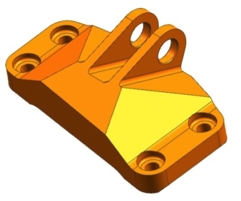
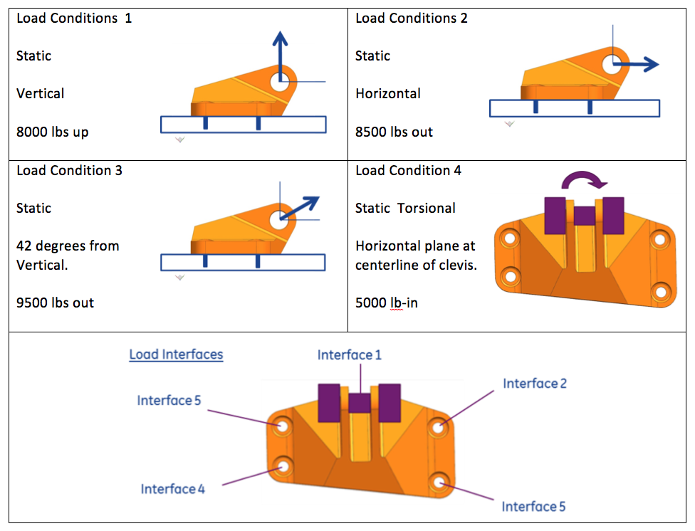

# Part Brief — GE Jet Engine Bracket

| Attribute | Value |
| --- | --- |
| Source | [GrabCAD — GE jet engine bracket challenge](https://grabcad.com/challenges/ge-jet-engine-bracket-challenge) |
| Sponsor | GE Aviation, run on GrabCAD, June–December 2013 |
| Accessed | 2026-09-13 |
| Status | **Adopted as the demo part** `ge_bracket` in requirements v0.5 (D-14): a parametric FreeCAD rebuild, LC1, checked for **3-axis CNC machining** in FreeCAD's CAM Workbench (D-11) — a departure from the challenge's additive brief, consistent with the original machined part (§1). Section 7's CadQuery, FDM and `metal_am` suggestions are superseded by D-04 and D-11 |
| Related | [SimJEB dataset](simjeb-dataset.md) · [Requirements](requirements.md) · [Plan](plan.md) · [Solution architecture](solution-architecture.md) |

This page turns the challenge web page into markdown. Sections 1–5 give the
challenge's own figures. Metric conversions are added in brackets. Section 6
gives answers from the organisers and open points from the challenge comment
thread. Section 7 is this project's reading of how the brief fits the
requirements. It is our interpretation, not part of the challenge.

## 1. The part

A loading bracket on a jet engine. It carries the engine's weight during
handling and must not break or bend out of shape. It is used only now and then,
but it stays on the engine all the time, including in flight. So any mass it
carries is paid for on every flight. The bracket was designed for conventional
manufacturing. The challenge asks for a redesign that uses additive
manufacturing to cut mass without losing performance.

**Geometry.** The bracket has a flat base with four bolt holes, one at each
corner. The base carries a two-arm clevis that holds a pin. The base has
chamfered, sloping faces that run up to the clevis arms.

**Original CAD.** The challenge supplied a STEP file of the original part through
its "Download specifications" button
(`https://grabcad.com/competitions/specs/110/original.stp`). **As of 2026-09-13
that URL returns HTTP 404.** The geometry must now come from somewhere else (see
section 7).

## 2. Interfaces and boundary conditions

| Interface | Feature | Dimensions | Modelling assumption |
| --- | --- | --- | --- |
| 1 | Pin through the clevis arms | Ø 0.75 in [19.05 mm] | Pin is **infinitely stiff**. **All loads are applied here.** |
| 2–5 | Base bolt holes, 0.375-24 AS3239-26 machine bolt | Bolt Ø 0.375 in [9.525 mm]; nut face 0.405 in [10.287 mm] max ID, 0.558 in [14.173 mm] min OD | Bolts are **infinitely stiff**. Interfaces 2–5 are **fixed**. |

- Interface dimensions are mandatory: **a design that does not match them is
  disqualified.**
- The interface graphic has a typo: two corners are labelled "Interface 5". The
  bottom-right hole is presumably Interface 3.
- The nut-face annulus (ID 0.405 in, OD 0.558 in) is the natural fixed patch on
  the base's top surface at each bolt.

## 3. Load conditions

Each load condition is applied **on its own**, never combined. The load goes
through the pin at Interface 1, with Interfaces 2–5 fixed. All loads are
**static**.

| # | Type | Magnitude | Direction (per the challenge graphic) |
| --- | --- | --- | --- |
| LC1 | Linear | 8,000 lbf [35.59 kN] | Vertical **up**: normal to the base, pulling the pin away from it |
| LC2 | Linear | 8,500 lbf [37.81 kN] | Horizontal **out**: parallel to the base, normal to the pin axis, pointing away from the bracket body |
| LC3 | Linear | 9,500 lbf [42.26 kN] | **42° from vertical**: in the same plane as LC1 and LC2, tilted from up toward out |
| LC4 | Torsional | 5,000 lbf·in [564.9 N·m] | Moment in the **horizontal plane** (axis normal to the base). Applied at the point where the pin centreline meets the midplane between the clevis arms |

Conversions: 1 lbf = 4.44822 N; 1 lbf·in = 0.112985 N·m.

**LC3 angle history.** The first graphic read "30° from horizontal", which is
60° from vertical. The organisers then posted corrected load conditions, and in
the thread they confirmed that **"42 degrees is the updated angle"**. The
figure to use is 42° from vertical.

**Directions settled by SimJEB.** The [SimJEB](simjeb-dataset.md) solver decks
write these loads down exactly, with +z vertical up:

| # | Vector in the SimJEB frame |
| --- | --- |
| LC1 | FORCE (0, 0, +35,585.77) N |
| LC2 | FORCE (−37,809.9, 0, 0) N, so "out" is −x |
| LC3 | FORCE (−28,276.2, 0, +31,403.9) N, which is exactly 42.00° from vertical |
| LC4 | MOMENT (0, 0, +564,924.2) N·mm |

Bolts are fixed through RBE2 rigid spiders; the pin load enters through an RBE3
distributing spider on the bore.

**Units.** The page says "lbs". One participant asked whether this means lbf or
lbm, and the page shows no answer. We read it as **pound-force**. The page gives
these values as loads, and the "lb-in" torque only makes sense as a force unit.

**Beyond the listed loads.** In physical testing, designs that pass these loads
are then loaded further to find their ultimate capability.

## 4. Material, environment and manufacturing

| Item | Value |
| --- | --- |
| Material | Ti-6Al-4V |
| Yield strength | **131 ksi [903.2 MPa]**, set by the organisers ("Assume yield strength is 131 ksi") |
| Service temperature | 75 °F [23.9 °C] |
| Process | Additive manufacturing. Participants assumed DMLM/DMLS; the page does not name a process |
| Minimum feature size (wall thickness) | **0.050 in [1.27 mm]** |
| Envelope | The optimised geometry **must fit inside the original part's envelope** |

The challenge does **not** give density, Young's modulus or Poisson's ratio. Take
them from the project material library ([requirements D-09](requirements.md)),
with a cited source.

## 5. Objective and judging

- **Objective:** the lowest mass that still meets every performance criterion.
  "Participants should target the lightest weight designs."
- **Gate before ranking.** A design must meet the load conditions and the
  envelope and interface constraints before its mass reduction counts.
- **Reporting.** Entrants posted their mass or volume reduction against the
  original part.
- **Phase I** (11 Jun – 9 Aug 2013): judges evaluated designs in simulation, and
  the top 10 won $1,000 each.
- **Phase II** (17 Sep – 15 Nov 2013): the top 10 were built by additive
  manufacturing and physically tested under the load cases. Judges also rated
  suitability for additive production, load at failure and long-term
  durability. The top 8 by lowest mass that passed all criteria shared $20,000
  ($7k / $5k / $3k / 5 × $1k).
- **Jury:** five experts from GE and GrabCAD.
- **Submission format:** STEP or IGES, made in any CAD tool.

## 6. Clarifications and gaps from the comment thread

| Topic | What is known |
| --- | --- |
| **Safety factor** | **None prescribed.** The judges wrote: *"Regarding the safety factor, this is up to the contestants to evaluate based on the geometry they create. There are other factors we will consider such as suitability for additive manufacturing … It wouldn't be fair to force everyone into the 'worst-case' safety factor."* |
| **Displacement limit** | **None prescribed.** A participant asked for a displacement tolerance under full load. No answer is visible on the page. |
| **Stress criterion** | Implied: peak stress below the 131 ksi yield under each load case. |
| **Original mass** | **Not given by the organisers.** One participant's CAD reported about 4.52 lb [≈ 2.05 kg] for the original part. That figure is unverified, so re-measure it from the geometry. |
| **Trapped powder / hollow volumes** | Asked by a participant; no answer visible. |
| **Envelope tolerance** | Asked whether small protrusions outside the envelope are allowed; no answer visible. Treat the envelope as hard. |
| **Results for scale** | Entrants reported roughly 72–78% mass reduction, for example 480 g with a peak von Mises stress of 116 ksi. These are participants' own claims, not verified results. The independent re-simulation in [SimJEB](simjeb-dataset.md) covers 381 entries. Only 147 stay under 903 MPa in all four load cases, and the lightest of those is 0.345 kg. |

## 7. Fit against this project's requirements

The brief is a realistic, well-known benchmark. It clashes with several fixed
decisions in [requirements.md](requirements.md). Each clash has to be settled,
either by changing the brief or by changing the decision, before the bracket can
become a task. [Plan M0.5 task 1](plan.md) ("`L_bracket` confirmed or replaced")
is where that decision is made.

| Requirement / decision | Challenge says | Conflict and suggested resolution |
| --- | --- | --- |
| D-01 linear static, von Mises vs yield | Static loads, yield 131 ksi | **Fits.** Ultimate-capability testing and durability are out of scope, which matches D-01. |
| D-04 CadQuery parametric model, named parameters only | Free-form STEP geometry; entrants used topology optimisation | **Conflict.** The agent cannot edit STEP. Rebuild a simplified parametric bracket in CadQuery: base plate, four bolt bosses, two clevis arms, gussets. Fix the Interface 1–5 dimensions; the envelope is the parameter bounds. |
| D-05 edit vocabulary | Any geometry inside the envelope | Map the levers to `wall_thickness` (base, arms, gussets), `fillet_radius` (arm-to-base root), `pocket_depth` (base and gusset lightening pockets), `hole_diameter` (lightening holes). Floor every thickness at 1.27 mm. |
| D-06 named regions | — | Candidate labels: `clevis_arm`, `pin_bore`, `arm_root_fillet`, `gusset`, `base_plate`, `bolt_boss`, `bulk`. |
| D-08 one load case per task | **Four** load cases, all required | **Conflict.** Either (a) make each LCn its own task, so a design "passes" only in the scoped sense of that task, or (b) relax D-08 to take the worst case over LC1–LC4. Option (a) keeps v1 scope. Option (b) is what the real challenge needs. If only one case is kept, pick LC1 vertical. It governs peak stress in 318 of the 381 [SimJEB](simjeb-dataset.md) designs, while LC3, despite the largest force, governs only 11. |
| D-09 material library | Ti-6Al-4V at 131 ksi | Ti-6Al-4V is already in the library. The task should override yield to 903 MPa for this brief and cite the challenge as the source. Material substitution runs against the challenge brief, which fixes Ti-6Al-4V. Use it only for the material-led task variant, and label that variant as leaving the brief. |
| D-11 manufacturing check, FDM profile | Metal AM, minimum wall 0.050 in | **Partial fit.** The minimum-wall ray cast carries over at 1.27 mm. The FDM overhang rule does not apply to metal powder-bed builds (those have support and overhang rules of their own, often about 45°). Add a `metal_am` profile, or keep min-wall only. |
| Section 3 SF and displacement limit | Neither given | **Project must choose.** Suggest SF = 1.5 on 903 MPa, giving an allowable of 602 MPa. Take the displacement limit from the baseline's own displacement (for example ≤ 1.1 × baseline) until a real limit exists. Record both as project choices, not challenge data. |
| D-17 units | Imperial | Tasks are written in SI (N, mm, MPa). The lbf→N and ksi→MPa conversions in this page are the single source. This is also a natural MPa/Pa unit-mutation fixture. |
| Mutation corpus (D-16) | — | Wrong-direction mutant: LC1 flipped to "down", or LC3 at 30° from horizontal instead of 42° from vertical. The second is a real mistake that occurred in this very challenge. |
| Refusal case | Entrants hit about 75% reduction | An unmeetable mass target for the refusal fixture, such as a 95% reduction at SF 1.5 inside the parametric space. |
| Geometry source | STEP link is dead (404) | [SimJEB](simjeb-dataset.md) gives 381 cleaned entry designs in a common mm frame with identical interface locations, but not GE's original part. Take interface coordinates from SimJEB and rebuild the parametric baseline around them. SimJEB CAD is licensed non-commercial, so fetch it and do not commit it. |

## 8. References

- GrabCAD, *GE jet engine bracket challenge* — description, requirements, rules and
  comment thread. <https://grabcad.com/challenges/ge-jet-engine-bracket-challenge>,
  accessed 2026-09-13.
- Whalen, Beyene, Mueller, *SimJEB: Simulated Jet Engine Bracket Dataset*, Harvard
  Dataverse [doi:10.7910/DVN/XFUWJG](https://doi.org/10.7910/DVN/XFUWJG). Summarised in
  [simjeb-dataset.md](simjeb-dataset.md).
- Images in `assets/ge-bracket/` are copied from the challenge page for reference
  (© GE / GrabCAD).
